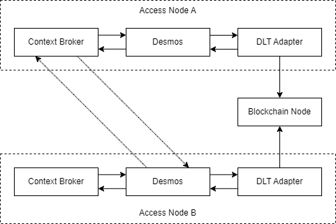

<h1>Entorno Local para test E2E de Desmos</h1>

# Introducción

El compose.yaml de esta carpeta permite levantar un entorno local para test E2E de Desmos.
Esto es, 2 instancias de un Access Node (Context Broker, Desmos, DLT-Adapter), un nodo blockchain de prueba (compartido 
para los dos Access Nodes) y un Nginx que facilita la comunicación entre los Access Nodes y el nodo blockchain.

# Requisitos
- Docker Desktop

# ¿Cómo usarlo?
El compose levanta 2 Access Nodes. Uno emúla sirve para emular el comportamiento del DOME Marketplace y el otro para
emular el comportamiento de un Marketplace federado. 

Por último, usamos una instancia de nodo blockchain de Ganache para simular la red de blockchain en la cual se despliega
el Smart Contract empleado en la red real de Alastria.

La idea de este entorno es poder verificar:
- Setup del aplicativo de Desmos.
- Creación de las subscripciones iniciales (hacia el Context Broker y hacia el DLT-Adapter).
- Verificar el workflow de publicación de un ProductOffering en el Shared Catalog (el nodo blockchain).
- Verificar el workflow de la sincronización del dato de la blockchain hacia el Context Broker - SubscribeWorkflow.
- Verificar la inicialización de un Marketplace, el cual se espera que extraiga la información de los ProductOfferings
  publicados en el Shared Catalog.